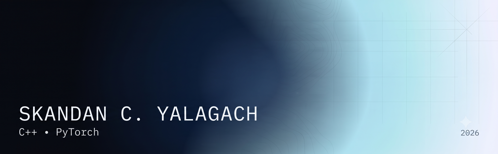

<!-- <h1 align="center">Skandan C. Yalagach</h1> -->

Systems -- Machine Learning -- Computer Vision

Computer Science undergraduate working across,
numerical computing, machine learning infrastructure and Computer Vision.

I write C++ for machine learning workloads, with attention to
memory access patterns, cache locality, SIMD execution, and multi-core scaling.

<a href="mailto:skandanyalagach@gmail.com">Email</a> •
<a href="https://linkedin.com/in/skandancy">LinkedIn</a> •
<a href="https://github.com/skandanyal">GitHub</a> •
<a href="https://skandanyal.github.io/from_math_to_machines">Technical Blog</a>

---
<h1 align="center">About</h1>

<strong>The National Institute of Engineering, Mysore</strong> 
B.E. Computer Science & Engineering (Artificial Intelligence & Machine Learning) 
Mysore, India · 2023 – Present

---

